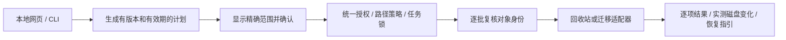

# DeepClean 代码审查与低成本增长方案

审查日期：2026-09-06。源码基线：`374eccd63382b74a200c17a6e4cbebce264bffb5`。本次只提出建议，没有修改产品源码或清理真实用户数据。

**建议先完成数据保护和核心交互修复，再做小范围公开测试。保留 Python 标准库、本地网页和开放规则的架构。** 当前定位适合个人开发者维护；最值得投入的是可靠的规则、准确的操作结果和容易下载的发行包。

本次检查了后端、前端运行逻辑、五组规则、启动/打包/技能安装脚本和已有测试。当前规则定义了 45 个工具、52 个分项。没有测量真实用户目录的扫描性能，没有验证分发 EXE 与源码的一致性，也没有执行真实迁移或管理员攻击。安全扫描的详细覆盖以其独立报告为准。

## 1. 发布前必须解决的问题

以下 P1/P2 是工程处理优先级；安全漏洞的 medium 评级单独说明，不能把本机条件漏洞理解为公网高危漏洞。

| 优先级 | 问题与源码证据 | 后果 | 最小修复与验收 |
|---|---|---|---|
| P1 | `rules/ai.json:331–342` 把整个 `.gemini/tmp` 归入 safe，保留期仅 60 分钟 | Gemini 官方文档将会话记录放在 `.gemini/tmp/<project>/chats/`；已有聊天记录会被递归当作缓存处理。现有关键字 lint 没有识别父目录覆盖子目录 | 立即停用此宽泛规则；对会话/计划等持久数据实施拒绝策略；仅重新开放经过版本验证的明确缓存子目录。夹具中的聊天记录必须在所有模式下保留 |
| P1 | `app.py:242–265, 384–395, 630–654, 886–900` 只按类别保护，没有最终路径和对象身份保护 | 规则根链接或扫描后祖先替换可让受保护数据进入清理；管理员场景还可形成跨权限删除。安全评级 medium | 根、祖先、最终目标统一检查；未批准重解析点拒绝；执行前复核文件身份/mtime/类型。跨权限删除不能只靠 realpath 后再按字符串删除，必须绑定句柄或拒绝不可信目录 |
| P1 | `app.py:793–810` 迁移用总字节数差比较，允许至少 1 MiB 或 0.1% 差异，随后删除源备份 | 无法证明文件内容相同；复制期间新写入的数据可能未复制却随备份删除；`ignore_errors=True` 也可能把残留备份当作成功 | 暂时仅提供预览/实验入口；迁移前停止写入，生成逐文件清单，复制到本次专有临时目标并校验，记录事务阶段，验证 junction 实际目标，再完成源清理；每一失败阶段都能恢复 |
| P1 | `rules/models.json:11,18,32` 的 move_root 比 paths 大；`app.py:753–764` 直接使用 move_root | HF/Ollama/LM Studio 界面展示模型，实际迁移整个用户状态目录；LM Studio 的另一条 `.cache/lm-studio/models` 扫描路径不能由当前 move_root 正确迁移 | 让扫描、预览、批准和执行使用同一个明确目录；支持多个模型位置及配置路径，检查同盘/已迁移状态；目标目录权限必须验证 |
| P1 | `static/index.html:871–897` 将 `S.drive.free + freed` 展示为清理后空间；`app.py:643–650` 的 freed 是处理文件的逻辑大小 | 送入同盘回收站通常不直接释放相应空间，且硬链接/稀疏文件也使逻辑大小不同于物理占用；成功页会夸大收益 | 分开显示“已送回收站”“已迁移”“磁盘可用空间变化”；前后都读取 disk_usage，注明其他进程也可能影响差值；绝不加法伪造后值 |
| P1 | `static/index.html:624–626` 操作栏只统计当前分类，但 `827,854` 提交所有分类中 selected 的项 | 在 AI 页看到的数量与确认框/实际操作范围不同；默认其他分类也可能选中 | 统一可见范围、勾选状态、确认框与后端计划；或明确设计为全局购物车，持续显示跨页选择。发起操作时冻结同一份清单 |
| P2 | `app.py:1215–1234` 无调用者认证，本地客户端省略 Origin 即通过 | 另一用户/低权限进程可借服务账户或已提升实例清理、清空回收站、迁移及读取元数据。安全评级 medium；现有来源检查能限制普通跨站网页 | 普通权限运行；全部 API 使用每次启动随机凭据，凭据不能从未认证 GET 获取。管理员操作通过用户和操作绑定的受限 IPC/broker；保留 Host/Origin 防护 |
| P2 | `app.py:631–643` 按扫描时旧 mtime 判断保留期 | 扫描后重新写入或替换的文件仍可能被删除；属于确定的数据可靠性缺陷，纯同权限更新不另计安全漏洞 | 执行前重新 stat/校验身份与保留期，变更即跳过；计划带有效期、scan_id 和规则版本 |
| P2 | `app.py:526–547` 只拒绝 running，新任务可在 stopping 时进入；`747–767` 迁移检查与置 running 不在同一锁内 | 停止旧任务后重新启动会重置共享 stop/per；并发迁移可竞争同一源/目标；多个实例也没有互斥 | 引入统一任务状态机和操作锁；running/stopping 都不能重入；每个任务独立取消对象；同用户多实例用命名互斥量/锁；扫描和变更操作互斥 |
| P2 | `app.py:893,899–900` 排除只过滤 entries，dirs 未过滤 | 被排除目录中的空目录仍可能被 rmdir；子目录排除、大小写不同的等价路径也不具备文案所暗示的语义 | 排除策略作用于文件与目录；规范化Windows大小写/分隔符；明确支持根排除还是任意子树排除，并校验祖先关系 |

Gemini 规则结论来自当前项目规则与[官方 Auto Memory 文档](https://geminicli.com/docs/cli/auto-memory/)的对照。未对用户安装的具体 Gemini 版本读取会话内容；发布前需补支持版本夹具。HF 的环境路径配置也应以[官方缓存管理文档](https://github.com/huggingface/huggingface_hub/blob/main/docs/source/en/guides/manage-cache.md)为依据；Ollama 支持 `OLLAMA_MODELS`，可参考[官方 Windows 文档](https://docs.ollama.com/windows)。

此外，`cursor-index` 整体删除 workspaceStorage、`codex-runtime` 整体删除应用目录、OfficeFileCache、通配 `*-updater` 等规则应进入版本核实队列。本次没有证明每个上游目录都能安全重建，不应把“名字像 cache/tmp”作为安全证据。`pytorch-cache` 的文案明确包含权重，却标 safe，与“模型只迁移”的整体承诺不一致，应拆分编译缓存和权重。

## 2. 回收站、迁移和测试中的可靠性细节

我们应保留失败跳过、locked/migrate 后端过滤和回收站单独执行这三项已有保护，但修正过强承诺。

- `FOF_ALLOWUNDO` 表示尽可能保留撤销信息，并非任何介质/设置下都保证送入回收站；当前测试只 mock 返回值和 flags，不能证明实际可恢复。Windows 官方建议使用 IFileOperation；若升级，应核实强制回收站行为和逐项结果，并在不支持回收时跳过，而不是批准永久删除。[Microsoft API 文档](https://learn.microsoft.com/en-us/windows/win32/api/shellapi/ns-shellapi-shfileopstructw)
- `app.py:189–205` 的 SHQUERYRBINFO 字段声明不符合官方的 `cbSize/i64Size/i64NumItems`。某些布局下填充使大小偏移碰巧相同，不能据此承诺所有架构失效；应按 ABI 定义并验证 sizeof/offset、64 位和支持架构。查询错误不能一概当成空回收站。[Microsoft 结构定义](https://learn.microsoft.com/en-us/windows/win32/api/shellapi/ns-shellapi-shqueryrbinfo)
- `_recycle_batch` 整批部分成功后逐文件重试，可能把已成功但现在不存在的文件记成失败。建议逐项结果、去重和稳定 operation_id。
- 清理/迁移完成后，`refreshState` 只读旧 SCAN 结果，没有重新扫描或使其失效，旧大小及文件列表仍在。完成后局部重扫或明确标记“结果已过期”。
- 迁移至少增加：目标不存在检查和预留的原子性、同盘拒绝、合法工具 ID 和盘符校验、目标已是联接的处理、Unicode/空格路径、长路径、权限不足、断电恢复及目标剩余空间变化测试。
- `CLEAR_C_SANDBOX` 仅注入测试分类，却全局切换永久删除，**不是隔离边界**。应让测试只能看到测试规则、所有派生目标必须留在临时根、删除适配器显式注入。生产包去掉测试用全局永久删除开关更容易维护。
- `tests/test_sandbox.py` 没有将 SCAN.cats 限定到 sandbox，迁移目标还是盘符根下的 DeepCleanMoved。因此本次没有直接运行这份“不会触碰真实目录”的测试。修正隔离后再加入 CI。

## 3. 性能优化：先消除多余工作，再调整并发

这些是由源码推导的瓶颈与验收方案，**不是已测得的提速结果**。当前主要成本是文件系统遍历、元数据存储和 Windows Shell 调用；没有引入服务端缓存、Redis 或重型前端框架的必要。

| 顺序 | 源码现状 | 建议 | 如何判断有效 |
|---|---|---|---|
| 1 | `app.py:313–314` 每次扫描所有52项；`_cli_scan_if_needed` 为指定一项清理也全扫；前端“仅系统”只切换视图 | 新增按分类/工具/ids 的扫描范围；CLI clean 只为目标生成计划；首屏优先AI用户目录，系统深扫用户触发 | 同一夹具比较首个结果时间、总扫描文件数、总耗时；确认未选目录零访问 |
| 2 | `app.py:285–287,342–407` 所有分类都保存完整 entries 和 dirs，包括不可删除的模型及会话 | locked/migrate 只保留聚合结果；可清理分类采用全局条目/内存上限，超限标部分结果；必要时用标准库SQLite保存计划清单，位置与权限受保护 | 10万/40万/多分类百万条目夹具测进程峰值RSS；不能只看Python分配，也不能用硬截断冒充完整 |
| 3 | `app.py:629–645` 一次生成 keep、路径列表、size字典与结果列表 | 边复核边分批执行，以有限队列控制内存；批间检查取消，进度按实际处理条目更新 | 对大量小文件观察峰值RSS、取消响应、部分失败计数；必须保证已批准计划不扩大 |
| 4 | 分类之间独立遍历，根可重复/包含，迁移后目标也可能不在C盘 | 用最终卷/对象身份去重，建立目录树索引合并重叠遍历；显示逻辑大小与物理占用的区别，单独标注跨盘目录 | 重叠根/硬链接/联接/稀疏文件夹具无重复统计；不把D盘内容算作C盘可释放 |
| 5 | 固定6个扫描线程，无磁盘类型或负载依据 | 对1/2/4/6线程做同数据冷暖缓存比较；优先限制同一磁盘并发，允许取消 | 分别在SSD/HDD测p50/p95耗时、磁盘忙时、前台交互延迟；无结果前不提高线程数 |
| 6 | `app.py:326–336` 扫描后再次遍历每条记录计算最新mtime；每次状态构建多次查询管理员身份 | 扫描时累计工具最大mtime；每次响应只求一次管理员状态；缓存只读规则投影；tasklist缓存刷新使用单飞锁 | 对大量条目比较扫描收尾时间；并发请求不重复启动tasklist |
| 7 | `static/index.html:783,864,978` 异步setInterval可重叠请求；请求无超时；完成后仍3秒轮询 | 改为请求完成后setTimeout调度，加入AbortController、错误状态和退避；任务完成/页面隐藏暂停；规则与进度接口拆分 | 慢响应/服务重启时只有一个在途轮询，按钮可恢复；空闲时无持续请求 |
| 8 | `app.py:1291–1299` 仅限制最大body；没有负长度/JSON类型/读超时控制；线程HTTP服务无连接上限 | 严格校验非负长度、JSON对象、字段类型；连接超时、并发上限和启动接口限速 | 非法/慢请求返回确定错误并释放资源；这是本机稳健性优化，不单独夸大为公网DoS |

建议第一组性能夹具覆盖：少量大模型、大量小缓存、深目录、权限拒绝、重复根、稀疏/硬链接、正在写入文件。保存扫描文件数、冷暖缓存、机器/磁盘型号、Python版本、峰值RSS和p95，先建立基线再设目标。预算内可以先用标准库计时和 Windows 进程指标。

`mtime` 只表明文件内容的修改时间，不能可靠代表“工具上次使用时间”（`app.py:1133–1137`）。建议改名为“缓存最近变更”，避免据此劝用户迁移仍在使用的模型。

## 4. 整体工程与产品优化

我们可以在现有架构内把责任拆清，降低后续每增加一条规则的风险。建议逐步拆出 `rules_loader`、`path_policy`、`scan_engine`、`clean_engine`、`move_engine`、`job_manager`、`windows_adapter` 和 HTTP/CLI 两个薄入口；前端拆为样式、状态、视图和翻译资源即可。模块化本身不保证性能提升，目的在于让安全约束和测试集中。

建议目标流程：

计划包含 scan_id、rule_version、规范化根、排除子树、文件身份及元数据、保留期、执行方式、过期时间；执行消耗同一计划而不是重新用 ids 生成扩大后的范围。CLI 两次启动目前会两次扫描，预览和 `--yes` 不是同一快照，也应通过计划持久化/摘要解决。

我们优先选择“普通权限单进程 + 统一执行入口”。如果后续确有管理员清理需求，再增加仅允许明确操作的提权代理。普通浏览器token只是一层授权门禁，不能承诺隔离所有同用户恶意进程；需要保护管理员权限时必须额外设计OS身份和操作边界。架构权衡的独立说明见安全扫描的 hardening 派生报告。

需要补齐的产品交互：

- `static/index.html:715,747–764` 的分项复选按钮没有对应事件绑定，目前只支持工具级勾选。补 bucket ID 和事件委托，验证“只清某一分项”真实生效。
- `moveDrive` 默认 D，页面只显示盘符，没有盘符选择绑定（`456,967,974`）。列出实际可写磁盘和空间，选定后预览；默认没有D盘不能成为死路。
- 遮罩没有接通停止接口；清理/迁移却复用“只读不删除”的扫描提示（`static/index.html:270–282`）。按任务显示真实阶段、可取消边界和状态，清理进度不能固定100%。
- `app.py:312–316` 的worker异常可能使顶层状态留在running；Scan/Clean/Move都需要异常终态、结构化错误、finally释放锁；前端处理done/stopped/error而非无限等待。
- 结果确认应由后端计划给出符合保留期且扣除排除目录后的预计处理量；当前前端sum仍为整类扫描大小。
- 启动脚本只探测8520，后端可用8520–8540；退出脚本只覆盖8520–8525且按端口强杀，不验证进程身份。改为每用户单实例、可靠健康信息和优雅退出；正在迁移时禁止无状态强杀。
- `打包exe.bat` 每次pip安装未锁定的PyInstaller，`.spec`也未纳入跟踪。固定已验证Python/打包依赖，CI从干净环境构建并保存构建信息、SHA-256及版本；下载者不能仅凭校验和推断来源可信。
- 项目当前 `.github` 只有Issue模板，未见CI工作流。接入现有48项检查、修正隔离后的迁移测试和关键前端操作测试；不要把脚本式check数量当作全面覆盖率。
- 规则增加 schema_version、支持版本、证据URL/日期、可重建原因、禁删子树、运行进程、测试夹具；加载失败和未知risk应关闭相应清理能力，而非默认safe。继续把新规则贡献作为社区参与入口。
- 自身运行目录、PyInstaller解包目录、历史和未完成迁移目录也应受保护，不能落入宽泛temp规则后被自己清理。

## 5. 免费使用、自愿支持作者的最小成本推广

已确认：`static/index.html:306–314,370–377` 存在“支持作者”，但四个渠道只有文字div，没有真实链接/二维码；`894–904` 已有“不再显示”偏好。推广计划以免费产品、自愿赞赏为前提，不增加账号、订阅服务器或遥测。

### 先接通收入入口

1. 只接通作者已经可用的一个主渠道，例如本地内置微信赞赏二维码，再加一个可用的外部支持链接；收款信息由作者提供，未配置的渠道隐藏。
2. 设置页永久保留；成功页只在成功处理且有明确价值时轻量展示，失败/取消/零处理不展示。保留关闭偏好，并跨实例端口稳定保存。
3. 内容不承诺付费后获得额外安全保护。可用文案：“如果深清帮你省下了排查时间，欢迎自愿支持持续维护。所有清理功能免费。”
4. README放同一支持渠道与维护目标；GitHub仓库可配置FUNDING入口，外链资格以对应平台实际开通状态为准。不要先开发支付订单系统。
5. 普通清理进入回收站后不要宣称已经释放同等空间来刺激打赏；赞赏建立在准确结果和省时价值上。

### 四周执行计划

下表为建议的试验计划和工作量，不是流量、转化或收入承诺；发布前修复工程另计。

| 时段 | 具体动作 | 产出与判断 |
|---|---|---|
| 第1周，约4–6小时推广准备 | 修复版提供便携EXE、源码、校验和、已知限制、恢复说明；录1个60–90秒演示：发现占用→确认保护→执行→展示实测结果；接通赞赏 | 一个可分享下载入口、一段演示、三张脱敏截图。亲自从干净Windows环境走完下载到首次扫描 |
| 第2周，约3–4小时 | 由作者在已有联系的Windows AI开发者群、合适的开源/开发者社区发两次针对性分享；招募10–20名自愿用户，先只读扫描，修复版再测试实际操作 | 获取安装失败、规则漏扫、误分类和恢复体验反馈。出现会话/模型误删立即停用相关规则并停止扩大推广 |
| 第3周，约3–4小时 | 把同一演示改写为两篇解决问题的内容：“AI工具把C盘占在哪里”“模型如何迁到其他盘”；每篇只放一个下载入口，明确作者身份 | 比较每篇内容带来的可归因下载/反馈，选择效果更好的主题。工具名+实际问题比泛称万能清理更容易解释价值 |
| 第4周，约2–3小时 | 发布规则更新和已解决问题清单；邀请用户贡献新工具路径夹具；对有效渠道复投同类内容 | 形成“用户反馈→规则验证→版本更新→再次分享”的循环。无有效反馈的渠道不继续投入 |

优先顺序：已有目标用户群 → 作者熟悉的开发者内容社区 → 适合演示的短视频平台。具体社区发布规则需在发布时核对；本次没有代发消息、联系用户、发布网站或上传项目。

### 成本控制

- 第一阶段用 GitHub README + Releases 作为说明/下载入口，不必购域名或服务器。若确需独立产品说明页，GitHub Pages可用于公开项目说明；不要上传应用后端或用户扫描数据，也不把Pages设计成支付商城。[GitHub Pages可用范围](https://docs.github.com/en/pages/getting-started-with-github-pages)与[使用限制](https://docs.github.com/en/pages/getting-started-with-github-pages/github-pages-limits)
- 公开仓库使用标准GitHub托管runner可免费运行Actions；构建产物保留时间和存储用量仍需控制，不假设任意runner或任意资源无限免费。[GitHub官方说明](https://docs.github.com/en/actions/reference/runners/github-hosted-runners)
- 第一月可把广告、服务器、域名支出定为0元；主要投入是上述约12–17小时内容与反馈处理，以及前置修复开发时间。平台手续费和未来签名证书等成本未计入；本次未核价，不预估成固定费用。
- EXE签名/信誉与Windows兼容性验证对推广有实际价值，应在产品效果得到验证后评估。不可建议用户关闭杀毒或系统保护来提高安装率。

### 怎么判断推广有效

保持无遥测承诺：先用下载资产计数、社区反馈、主动问卷和支持渠道汇总做人工记录。下载数不等于独立用户数，无法得出安装率/使用率；没有客户端事件数据时，不编造赞赏转化率。

优先看：能否顺利启动、首次扫描是否得到有用结果、有没有误分类/误删、真实磁盘变化是否解释清楚、恢复指引是否成功、每周支持请求耗时。清理工具是低频产品，不必为了日活加入自动删除提醒。

收入只能按假设计算，例如“500位实际完成使用的用户 × 假设1%自愿支持 × 假设10元 = 50元”。这不是预测；没有实测留存和支持数据前，赞赏宜用于补贴维护，不宜据此承诺商业收入。决定是否继续投入时同时记录作者工时。

## 6. 推荐实施顺序与成本

以下为单人熟悉该代码的粗估，非报价；Windows句柄/回收站/迁移故障恢复存在较大不确定性，发现兼容性问题应重新估算。

| 阶段 | 内容 | 粗估工作量 | 完成条件 |
|---|---|---|---|
| 发布止损 | 停用Gemini宽泛规则及待核实高风险规则；修正空间显示、选择范围；隐藏未接通赞赏渠道；迁移降为预览/实验 | 1–3人日 | 默认操作不处理会话；确认范围准确；结果不虚报 |
| 可信执行 | 统一计划/任务互斥、API门禁、路径重定向检查、对象复核、排除子树、错误终态；跨权限执行未做好前保持普通权限 | 4–8人日 | 新增关键负向测试通过；失败/取消不会启动第二个写任务或扩大范围 |
| 可信迁移 | 精确源范围、逐文件验证、事务日志、失败恢复、junction验证；必要时专门实现Windows适配层 | 5–10人日，可能更多 | 各阶段故障注入后数据仍可恢复；真实隔离Windows跨盘验证通过 |
| 性能与发行 | 范围扫描、锁定项聚合、有限批处理、轮询改进、打包CI、干净机器验收、真实支持入口 | 3–5人日 | 有可复现基准与发行包，现有测试和新增关键测试通过 |
| 小规模验证 | 先10–20人，确认稳定后按四周方案推广 | 每周约3–4小时 | 无未解决数据丢失问题；反馈能推动规则质量提升 |

这些任务有重叠，不能直接加总为精确交付承诺。预算不足时，可以先发布可靠的只读扫描和保守缓存清理，把迁移留在预览；一次只扩大经过验证的能力。

## 7. 本次验证记录

| 检查 | 结果 | 边界 |
|---|---|---|
| `python tests/test_rules.py` | 19项通过，退出码0 | 结构/关键字检查，不证明上游目录语义正确 |
| `python tests/test_http.py` | 15项通过，退出码0 | 临时沙盒、dry请求；不证明跨用户身份隔离 |
| `python tests/test_recycle.py` | 14项通过，退出码0 | Shell mock及临时文件；不证明真实回收站恢复 |
| `tests/test_sandbox.py` | 已静态审查，未执行 | 全局真实规则扫描和盘符根迁移目标不满足其隔离宣称 |
| 安全审查 | 两项经独立复核的medium问题 | 本机/可写目录/跨账户或管理员等前提；没有真实攻击测试 |
| 性能及前端 | 静态瓶颈和交互审查 | 未运行真实磁盘基准或完整浏览器E2E |
| 发布产物 | 检查打包配置 | 未验证现有EXE、签名、杀毒信誉、长路径和所有Windows版本 |

安全扫描产物由Codex Security单独生成；本文件是性能、可靠性、产品与推广建议，不替代其漏洞证据或覆盖记录。

安全扫描已完成并封存，登记2项medium漏洞，覆盖声明为partial。扫描提示工作树发生变化；本次新增的是本审查文档，未修改受审产品源码。

- [安全报告](C:/Users/onesun/AppData/Local/Temp/codex-security-scans-PGSXfZ/clear_c/374eccd63382b74a200c17a6e4cbebce264bffb5_20260905T234221Z_fn8a0nv6/report.md)
- [漏洞证据JSON](C:/Users/onesun/AppData/Local/Temp/codex-security-scans-PGSXfZ/clear_c/374eccd63382b74a200c17a6e4cbebce264bffb5_20260905T234221Z_fn8a0nv6/findings.json)
- [覆盖记录](C:/Users/onesun/AppData/Local/Temp/codex-security-scans-PGSXfZ/clear_c/374eccd63382b74a200c17a6e4cbebce264bffb5_20260905T234221Z_fn8a0nv6/coverage.json)
- [扫描清单](C:/Users/onesun/AppData/Local/Temp/codex-security-scans-PGSXfZ/clear_c/374eccd63382b74a200c17a6e4cbebce264bffb5_20260905T234221Z_fn8a0nv6/scan-manifest.json)
- [结构性安全方案](C:/Users/onesun/AppData/Local/Temp/codex-security-scans-PGSXfZ/clear_c/374eccd63382b74a200c17a6e4cbebce264bffb5_20260905T234221Z_fn8a0nv6/hardening/hardening.md)
- [方案结构化分析](C:/Users/onesun/AppData/Local/Temp/codex-security-scans-PGSXfZ/clear_c/374eccd63382b74a200c17a6e4cbebce264bffb5_20260905T234221Z_fn8a0nv6/hardening/hardening.json)
- [统一执行入口详细设计](C:/Users/onesun/AppData/Local/Temp/codex-security-scans-PGSXfZ/clear_c/374eccd63382b74a200c17a6e4cbebce264bffb5_20260905T234221Z_fn8a0nv6/hardening/proposals/execution-boundary.md)

插件返回的用量统计为跨4个任务累计：输入8,040,865 tokens（其中缓存输入7,680,768），输出45,466，总计8,086,331；统计来源codex_rollout，工具标记usage coverage为complete。该口径包含重复上下文，不是本报告字数、费用或本次新增消息的独立计费核算；usage的complete不代表源码覆盖完整。
